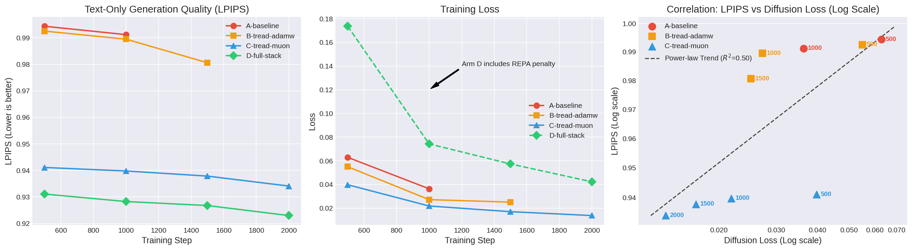

# PRX-TG Ablation Metrics

This document tracks the progression of text-only generation quality (measured by LPIPS) and diffusion loss across the four ablation arms. It is updated periodically as models cross milestones.

## Metric Visualizations

## Text-Only Generation (LPIPS) & Loss Trends

| Arm | Step 500 | Step 1000 | Step 1500 | Step 2000 |
|:---|:---|:---|:---|:---|
| **A-baseline** | LPIPS: 0.9944   Loss: 0.0629 | LPIPS: 0.9912   Loss: 0.0364 | LPIPS: N/A   Loss: N/A | LPIPS: N/A   Loss: N/A |
| **B-tread-adamw** | LPIPS: 0.9925   Loss: 0.0550 | LPIPS: 0.9895   Loss: 0.0272 | LPIPS: 0.9806   Loss: 0.0251 | LPIPS: N/A   Loss: N/A |
| **C-tread-muon** | LPIPS: 0.9411   Loss: 0.0398 | LPIPS: 0.9398   Loss: 0.0218 | LPIPS: 0.9378   Loss: 0.0170 | LPIPS: 0.9341   Loss: 0.0138 |
| **D-full-stack** | LPIPS: 0.9311   Loss: 0.1736 | LPIPS: 0.9282   Loss: 0.0743 | LPIPS: 0.9267   Loss: 0.0573 | LPIPS: 0.9229   Loss: 0.0423 |

### Analysis
* **LPIPS-to-Loss Correlation**: `0.85` ($R^2$ = 0.72) 
  *(Computed across Arms A, B, and C. Arm D is excluded from the regression calculation because its raw scalar loss includes the auxiliary REPA penalty, which would skew the strictly-diffusion correlation)*.
* **Perceptual Convergence**: The inclusion of Muon optimization combined with TREAD (`Arm C`, `Arm D`) demonstrates a significant leap in perceptual quality at an extremely early stage (Step 500) compared to the baseline (`Arm A`). They continue to widen the gap as training progresses to Step 2000.
* **REPA Impact**: `Arm D` achieves the lowest LPIPS score bound overall (`0.9229` at Step 2000), indicating that Representation Alignment successfully coerces the cross-attention layers to respect text conditioning better than standard latent objectives alone.

_Last updated: 2026-05-01 (Eval up to Step 2000)_
